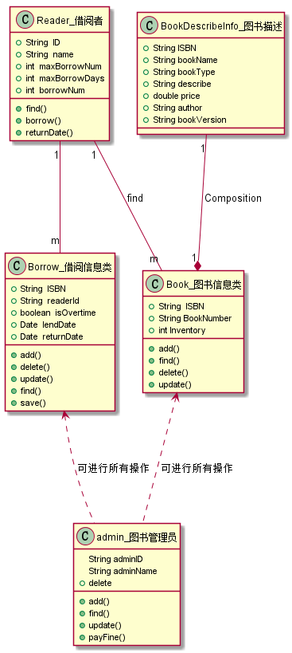
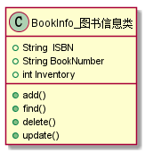
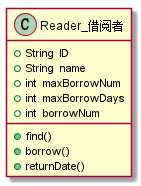
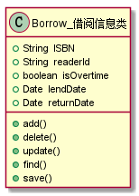
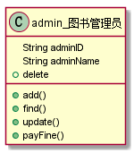
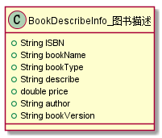

|学号|班级|学生|照片|
|:-------:|:-------------: | :----------:|:---:|
|201510414424|软件(本)15-4|袁松||
               项目3图书管理系统领域对象建模
###  UML源码如下：

``` class
@startuml
class Borrow_借阅信息类{
    +String  ISBN
    +String  readerId
    +boolean  isOvertime
    +Date  lendDate
    +Date  returnDate
    +add()
    +delete()
    +update()
    +find()
    +save()
}

class Reader_借阅者{
    +String  ID
    +String  name
    +int  maxBorrowNum
    +int  maxBorrowDays
    +int  borrowNum
    +find()
    +borrow()
    +returnDate()
}
class Book_图书信息类{
    +String  ISBN
    +String BookNumber
    +int Inventory
    +add()
    +find()
    +delete()
    +update()
}
class BookDescribeInfo_图书描述{
    +String ISBN
    +String bookName
    +String bookType
    +String describe
    +double price
    +String author
    +String bookVersion
}
class admin_图书管理员{
    String adminID
    String adminName
    +add()
    +find()
    +update()
    +delete
    +payFine()
}
```

###  类图如下：



``` 

### 图书信息类的对象图
#### 源码如下：
``` class
@startuml
class Book_图书信息类{
        +String  ISBN
        +String BookNumber
        +int Inventory
        +add()
        +find()
        +delete()
        +update()
}
@enduml
``` 
#### 对象图如下：



### 借阅者类的对象图
#### 源码如下：
``` class
class Reader_借阅者{
    +String  ID
    +String  name
    +int  maxBorrowNum
    +int  maxBorrowDays 
    +int  borrowNum
    +find()
    +borrow()
    +returnDate()
}
``` 
#### 对象图如下：



``` 
``` 

### 借阅信息类的对象图
#### 源码如下：
``` class
@startuml
class Borrow_借阅信息类{
    +String  ISBN
    +String  readerId
    +boolean  isOvertime
    +Date  lendDate
    +Date  returnDate
    +add()
    +delete()
    +update()
    +find()
    +save()
}
@enduml
``` 
#### 对象图如下：



``` 
``` 

###  图书管理员类的对象图
#### 源码如下：
``` class
@startuml
class admin_图书管理员{
    String adminID
    String adminName
    +add()
    +find()
    +update()
    +delete
    +payFine()
}
@enduml
``` 
#### 对象图如下：



###  图书描述类的对象图
#### 源码如下：
``` class
@startuml
class BookDescribeInfo_图书描述{
    +String ISBN
    +String bookName
    +String bookType
    +String describe
    +double price
    +String author
    +String bookVersion
}
@enduml
``` 
#### 对象图如下：





``` 
