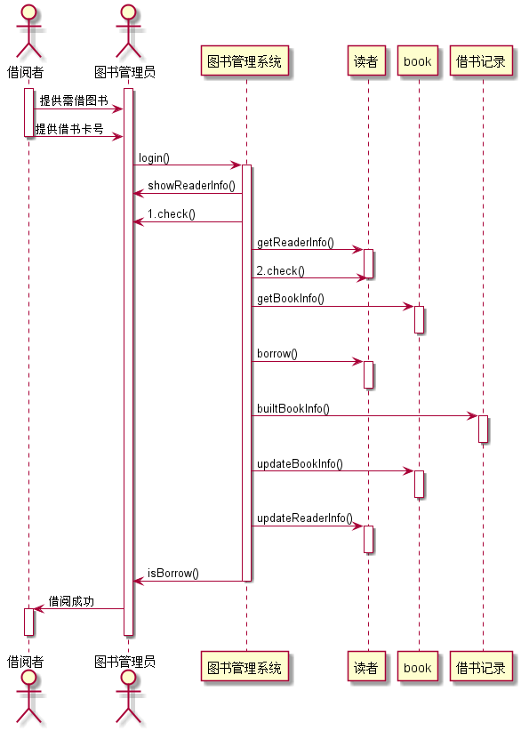
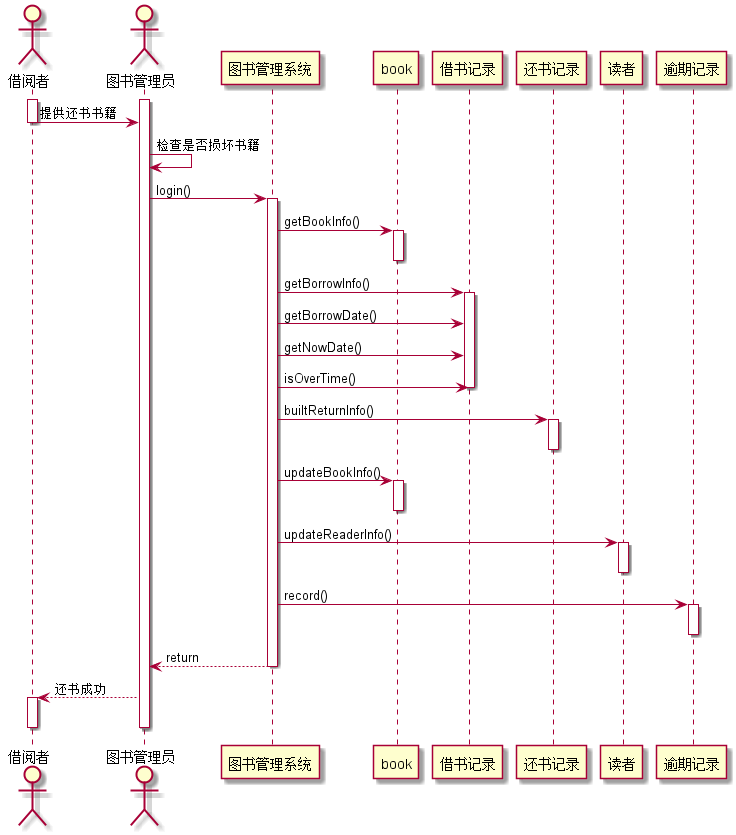

# 图书管理系统顺序图绘制
|学号|班级|姓名|照片|
|:-------:|:-------------: | :----------:|:---:|
|201510414424|软件(本)15-4|袁松||


## 1. 借书
## 借书UML源码

``` sequence
@startuml
actor  借阅者 as reader
actor  图书管理员 as admin
activate reader
activate admin
reader->admin:提供需借书籍
reader->admin:提供借书卡号
deactivate reader
admin->图书管理系统:login()
activate 图书管理系统
admin<-图书管理系统:showReaderInfo()
admin<-图书管理系统:1.check()
  图书管理系统->读者:getBookInfo()
activate 读者
图书管理系统->读者:2.check()
deactivate 读者
图书管理系统->book:getBookInfo()
activate book
deactivate book
图书管理系统->读者:borrow()
activate 读者
deactivate 读者
图书管理系统->借书记录:builtBorrowInfo()
activate 借书记录
deactivate 借书记录
图书管理系统->book:updateBookInfo()
activate book
deactivate book
图书管理系统->读者:updateReaderInfo()
activate 读者
deactivate 读者
图书管理系统-->admin:isBorrow()
deactivate 图书管理系统
admin-->reader:借阅成功
activate reader
deactivate reader
deactivate admin
@enduml


```

##  借书顺序图



## 2. 还书
## 幻术UML源码

``` sequence
@startuml
actor  借阅者 as reader
actor  图书管理员 as admin
activate reader
activate admin
reader->admin:   提供还书书籍
deactivate reader
admin->admin:检查是否损坏书籍
admin->图书管理系统:login()
activate 图书管理系统
图书管理系统->book:getBookInfo()
activate book
deactivate book
图书管理系统->借书记录:getBorrowInfo()
activate 借书记录
图书管理系统->借书记录:getBorrowDate()
图书管理系统->借书记录:getNowDate()
图书管理系统->借书记录:isOverTime()
deactivate 借书记录
图书管理系统->还书记录:builtReturnInfo()
activate 还书记录
deactivate 还书记录
图书管理系统->book:updateBookInfo()
activate book
deactivate book
图书管理系统->读者:updateReaderInfo()
activate 读者
deactivate 读者
图书管理系统->逾期记录:record()
activate 逾期记录
deactivate 逾期记录
图书管理系统-->admin:return
deactivate 图书管理系统
admin-->reader:还书成功
activate reader
deactivate reader
deactivate admin
@enduml
```

## 还书顺序图



``
## 3. 图书查询用例

###  查询UML源码

```aidl
@startuml
hide footbox
actor 读者或者管理员 as d
participant 查询界面 as c
participant bookcat
participant book
d->c:进入查询界面
activate d
note right:不需要登陆
activate c
c->bookcat:选择图书类目
activate bookcat
bookcat -> book:查询图书
activate book
book-->c:显示书籍信息
deactivate book
c-->d:得到相关信息
@enduml
```
###  图书查询时序图

## 4. 维护书目用例

###  维护UML源码

```aidl
@startuml
hide footbox
actor 管理员
participant 维护书籍界面
participant bookcat
participant book
管理员->维护书籍界面:login()
activate 管理员
activate 维护书籍界面
维护书籍界面-->维护书籍界面:success
activate 维护书籍界面 #SkyBlue
维护书籍界面->bookcat:维护书目
activate bookcat
bookcat-->维护书籍界面:更新成功
维护书籍界面->book:维护书籍
activate book
book-->维护书籍界面:更新成功
维护书籍界面-->管理员:退出
deactivate book
deactivate bookcat
deactivate bookcat
@enduml
```
###  维护书时序图


