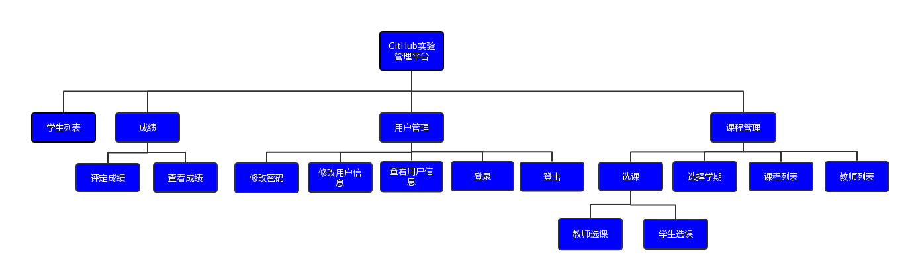
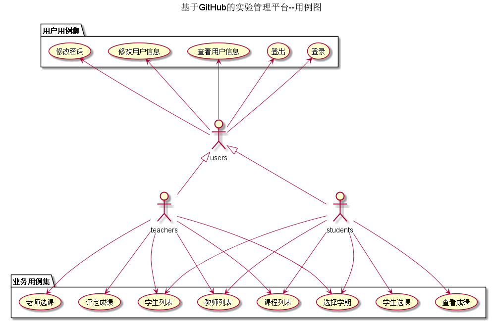
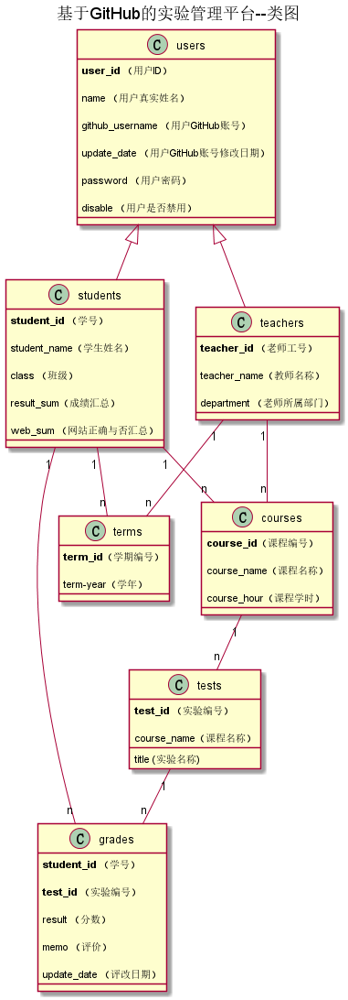

cC<!-- markdownlint-disable MD033-->
<!-- 禁止MD033类型的警告 https://www.npmjs.com/package/markdownlint -->

# 基于GitHub的实验管理平台的分析与设计

### 成都大学信息科学与工程学院

|学号|班级|姓名|照片|
|:-------:|:-------------: | :----------:|:---:|
|201510414424|软件(本)15-4|袁松||

## 1. 概述
- 基于GitHub的实验管理平台的作用是在线管理实验成绩的Web应用系统。学生和老师的实验内容均存放在GitHUB页面上。
- 学生的功能主要有：一是设置自己的GitHub用户名，二是可以选择学期查询哪门课程，三是查询自己该课程的实验成绩。学生的GitHub用户名是公开的，但成绩不公开。
- 老师的功能主要有：一是批改每个学生的成绩，二是查看每个学生的成绩。
- 老师和学生都能通过本系统的链接方便地跳转到学生的每个GitHUB实验目录，以便批改实验或者查看实验情况。
- 实验成绩按数字分数计算，每项实验含有多个评分项，评分项之和为100分，最低为0分。
- 系统自动计算每个学生的所有实验的平均分。
    
## 2. 系统总体结构

界面设计参见：https://yuansong8989.github.io/test6/ui/菜单页面.html
    
## 3. 用例图设计 [源码](src/UseCase.puml)

## 4. 类图设计 [源码](src/Class.puml)

## 5. 数据库设计
- ### [参见数据库设计](shujukusheji.md)

    

## 6. 用例及界面详细设计
- ### [“学生列表”用例](./UseCase/students.md)，[界面](https://yuansong8989.github.io/test6/ui/学生列表.html)
- ### [“评定成绩”用例](UseCase/pingpanchengji.md),[界面](https://yuansong8989.github.io/test6/ui/评定成绩.html)
- ### [“查看成绩”用例](UseCase/chakanchengji.md),[界面](https://yuansong8989.github.io/test6/ui/查看成绩.html)
- ### [“修改密码”用例](UseCase/xiugaimima.md),[界面](https://yuansong8989.github.io/test6/ui/修改密码.html)
- ### [“修改用户信息”用例](UseCase/yonghuxinxixiugai.md),[界面](https://yuansong8989.github.io/test6/ui/修改用户信息.html)
- ### [“查看用户信息”用例](UseCase/chakanyonghu.md),[界面](https://yuansong8989.github.io/test6/ui/查看用户信息.html)
- ### [“教师列表”用例](UseCase/jiaoshiliebiao.md),[界面](https://yuansong8989.github.io/test6/ui/学生选课.html)
- ### [“课程列表”用例](UseCase/kechengliebiao.md),[界面](https://yuansong8989.github.io/test6/ui/课程列表.html)
- ### [“教师选课”用例](./UseCase/老师选课.md),[界面](https://yuansong8989.github.io/test6/ui/教师选课.html)
- ### [“学生选课”用例](UseCase/xueshengxuanke.md),[界面](https://yuansong8989.github.io/test6/ui/学生选课.html)
- ### [“选学期”用例](UseCase/xuanxueqi.md),[界面](https://yuansong8989.github.io/test6/ui/选学期.html)
- ### [“登出”用例](UseCase/tuichu.md),[界面](https://yuansong8989.github.io/test6/ui/登出.html)
- ### [“登录”用例](UseCase/login.md),[界面](https://yuansong8989.github.io/test6/ui/登录.html)
    
